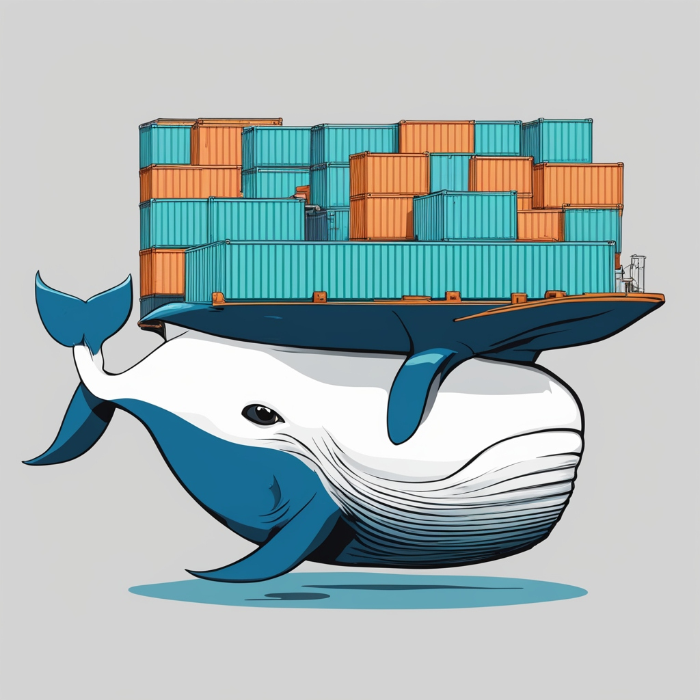

# Area



## Building images 🐋

Most images will be built using the `-f` option.<br>
This will tell docker what file to use to compile.<br>
And by setting the directory to `.` (local-root), it allows us to re-create the 'mono-repo' effect, but with only the necessary application & the shared app.

### Api
```sh
docker build -t api -f apps/api/Dockerfile .
docker run --env-file apps/api/.env --network=${port} api
```

### Front-end
```sh
docker build -t frontend -f apps/frontend/Dockerfile .
docker run --env-file apps/frontend/.env frontend
```

### Queue
```sh
docker build -t queue apps/queue
docker run --env-file apps/queue/.env queue
```
See [the queue README page.](apps/queue/README.md)

### Task-manager
```sh
docker build -t manager -f apps/task_manager/Dockerfile .
docker run --env-file apps/task_manager/.env  --network=${port} manager
```
`port` is network name, it's "host" or "bridge" or else depending on your environment. For dev environment, it's "host". 

### Worker
```sh
docker build -t worker -f apps/worker/Dockerfile .
docker run --env-file apps/worker/.env --network=${port} worker
```

## Docker-compose 🐋

In order to launch the different services of the project, we use a `docker-compose.yml` file. This file is at the root of the project and allows us to launch all the services at the same time or one at a time. Some services are dependent on others, and some interact with each other using the same volume.

List of services:

- queue (RabbitMQ):
    * Description: Acts as the message broker for the system, managing the task queue.
    * Ports: Exposes ports 5672 (main RabbitMQ port) and 15672 (management UI).
    * Healthcheck: Ensures RabbitMQ is healthy before other services start.
    * Dependencies: No explicit dependencies, but other services rely on it.

- manager:
    * Description: Likely responsible for managing tasks and sending them to the worker service.
    * Dependencies: Depends on queue being healthy.
    * Network: Uses host networking to directly communicate with other services.

- worker:
    * Description: Processes tasks from the queue, likely running the actual jobs.
    * Dependencies: Depends on queue being healthy.
    * Network: Uses host networking to directly access services like RabbitMQ.

- server (API):
    * Description: Serves the API for the system, handling external requests and distributing work to other services.
    * Ports: Exposes port 8080 for external API access.
    * Dependencies:
        Depends on queue being healthy.
        Depends on manager and worker to be started.
    * Network: Uses host network for performance and direct service access.

- client_mobile (Mobile Client):
    * Description: Frontend for mobile users, interacting with the server.
    * Volumes: Shares apk-volume, likely for distributing or accessing shared data (possibly APK files).
    * Network: Uses host networking to directly access backend services.

- client_web (Web Client):
    * Description: Web frontend for desktop users, interacting with the server.
    * Ports: Exposes port 8081 for web access.
    * Dependencies:
        Depends on client_mobile and server to be started.
    * Volumes: Shares apk-volume for shared data access.
    * Network: Uses bridge network, likely to isolate web traffic.

### Volume:
- apk-volume: Shared volume used by both client_mobile and client_web services for exchanging data, likely APK files for mobile applications.

### Service Dependencies Recap:
- manager and worker depend on queue (RabbitMQ) being healthy.
- server depends on queue, manager, and worker.
- client_web depends on both client_mobile and server.

This structure ensures that services are only started once their dependencies are healthy and running, creating a reliable workflow.